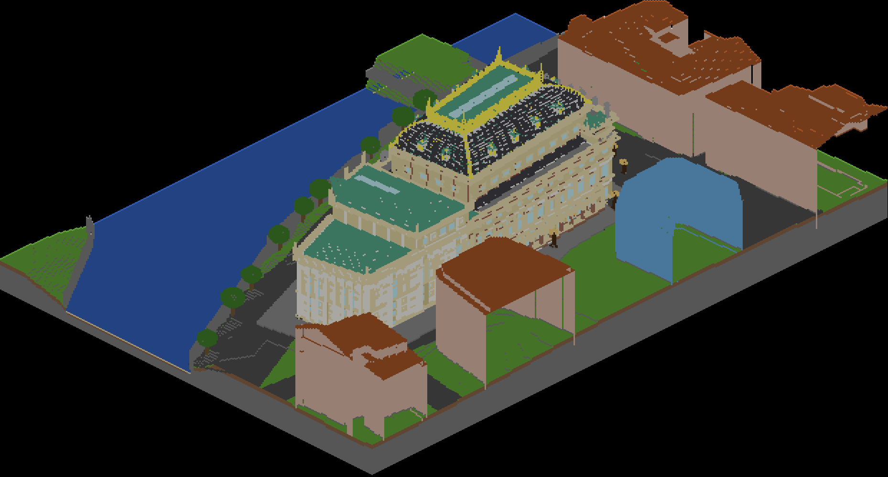
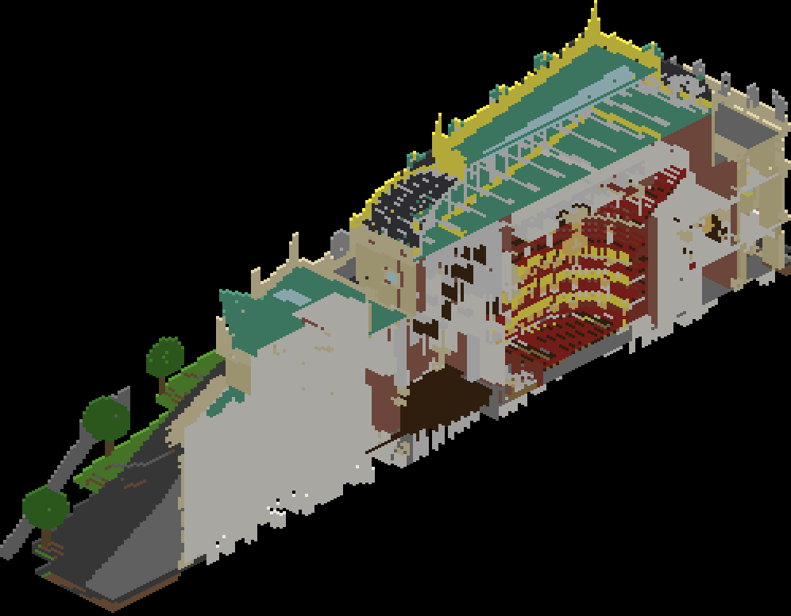
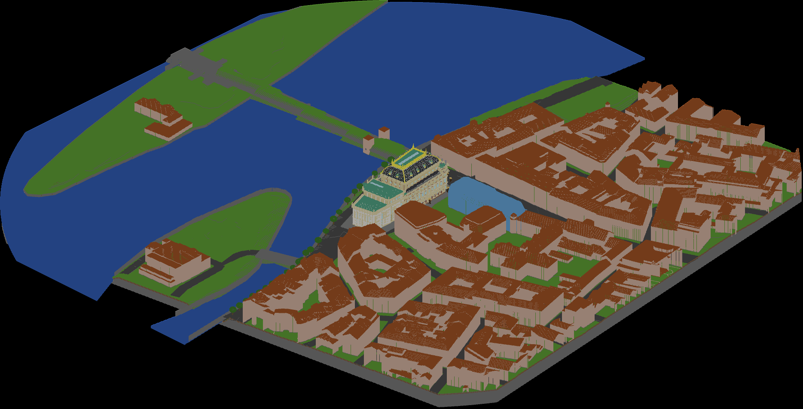

# The National Theatre in Minecraft

**A Minecraft map (Bedrock Edition – tablet, phone, Windows) of the National Theatre in Prague, inside and out: the horseshoe auditorium with its boxes, the foyer, the stage machinery, the dome with its golden crown – plus the surrounding slice of Prague from Střelecký Island to Národní street.**

[🇨🇿 Česká verze](README.md)

  <a href="https://github.com/Ondrula/narodni-divadlo-minecraft/raw/main/map/Narodni-divadlo.mcworld"><b>⬇️ Download the map (Narodni-divadlo.mcworld, 2.4 MB)</b></a> 
  version 0.1.0 · Minecraft Bedrock Edition 1.21.90 or newer · <a href="docs/instalace.md">installation guide (Czech)</a>

## Quick start

1. Download **Narodni-divadlo.mcworld** with the button above.
2. Open the file – in *Files* on iPad/iPhone, in *Downloads* on Android, double-click on Windows. Minecraft launches and imports the world.
3. Pick the world **Národní divadlo** in your world list. You spawn on Národní street in front of the main façade.

Bedrock Edition only (tablets, phones, Windows 10/11, consoles). Java Edition cannot open it – see the [roadmap](ROADMAP.md).

## What is in the map

- **The whole theatre at 2 blocks = 1 metre**, after the 1883 plans: sandstone façades, slate dome with gilded crown and spires, the trigae on the pylons, statues in the niches.
- **Interior:** the horseshoe auditorium with red seats, boxes and galleries, a lit chandelier, the foyer with its marble staircase, the stage with trap doors and fly system, basements down to the foundations.
- **Surroundings within ~330 m:** the Vltava, both embankments with their tree lines, Legion Bridge, Střelecký and Slovanský islands with the Žofín palace, the New Stage and 200+ neighbouring houses as massing (no windows – that part is yours).
- Creative mode, peaceful, permanent daylight.

Commands, coordinates of the interesting spots, block legend and known issues: [docs/co-je-v-mape.md](docs/co-je-v-mape.md) (Czech).

## How it came to be

I was showing my daughter the [interactive 3D model of the National Theatre](https://github.com/lukasersil/narodni-divadlo-3d) made by **Lukáš Eršil** – the construction phases from 1868, the X-ray view of the stage machinery, the 1881 fire. We looked at it together and thought: we'd love to play in that theatre in Minecraft. Walk across the stage, climb the dome, sit in the royal box.

Lukáš's model is open (MIT) and built precisely from period drawings, so it could be turned into blocks: we sliced it into 50 × 50 cm cubes and gave each cube a block by material – sandstone, gold, red velvet. The terrain, the river and the neighbouring houses come from open data published by the Prague Institute of Planning and Development (IPR). The whole process is explained in [docs/jak-to-vzniklo.md](docs/jak-to-vzniklo.md) (Czech) and technically in [pipeline/README.md](pipeline/README.md) (English); anyone can regenerate the map from it.

This project would not exist without Lukáš's work. It is his theatre; we only rebuilt it from blocks.

## Credits and sources

- **Lukáš Eršil – [narodni-divadlo-3d](https://github.com/lukasersil/narodni-divadlo-3d)** (MIT). The geometry of the whole building including the interior, stage machinery and sculptures, reconstructed from the plans of Josef Zítek and Josef Schulz and J. Fialka's 1883 drawings. The map is a derivative work of this model.
- **IPR Praha** – digital terrain model and 3D building model (CC BY 4.0): terrain, embankments, neighbouring buildings.
- **ČÚZK, RÚIAN** (CC BY 4.0) – footprint of the theatre.
- **OpenStreetMap** contributors (ODbL) – river, streets, Legion Bridge.

Full list with licence texts and citation wording: [docs/zdroje-a-licence.md](docs/zdroje-a-licence.md).

## Roadmap

Next: a finer interior (stairs instead of blocks, better seats, windows) and a Java Edition release. The bigger goal: **a map of part of Prague** – Old Town, Lesser Town, the Castle – generated from the same open IPR data, with this theatre dropped in as a detailed insert. See [ROADMAP.md](ROADMAP.md).

## Licence

Generator code (`pipeline/`) is [MIT](LICENSE). The map itself (`map/*.mcworld`) and the previews are [CC BY 4.0](LICENSE-MAP.md): share, remix and build on it freely, just credit Lukáš Eršil for the 3D model, IPR Praha and ČÚZK for the data, OpenStreetMap contributors and this project.

*Not an official project of the National Theatre or of Mojang/Microsoft. Minecraft is a trademark of Mojang AB.*
